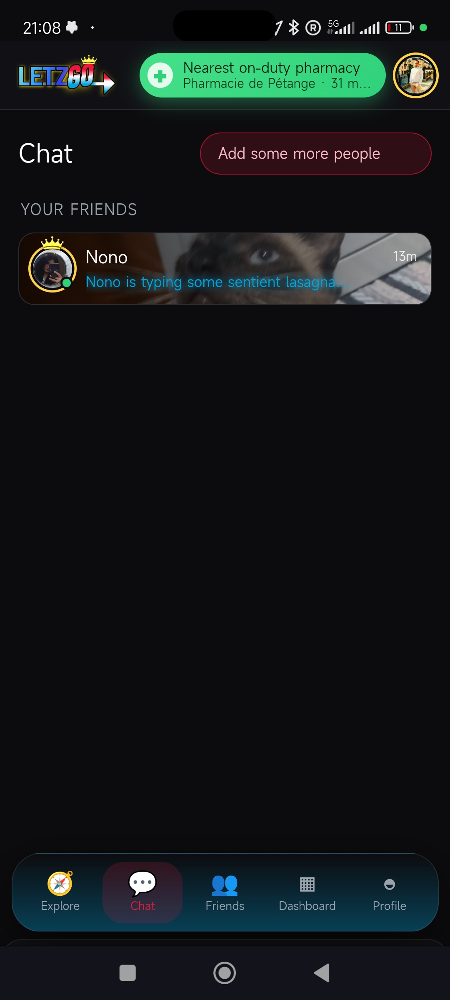
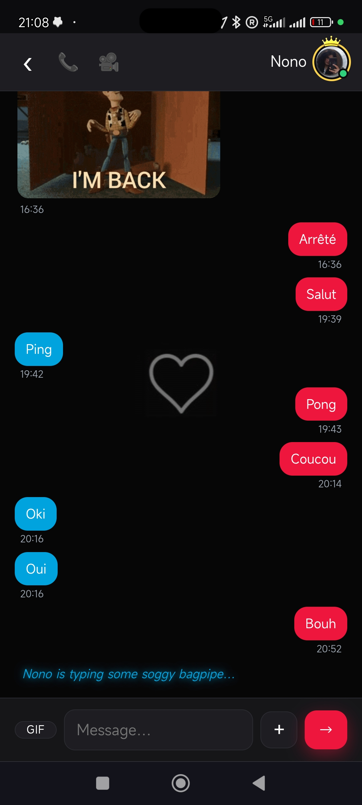
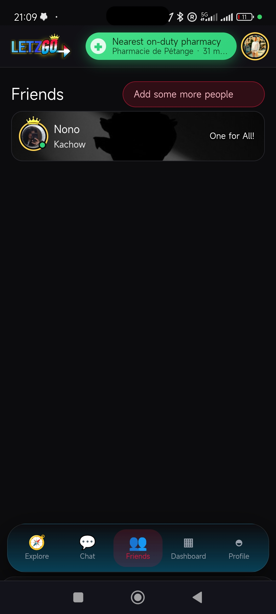
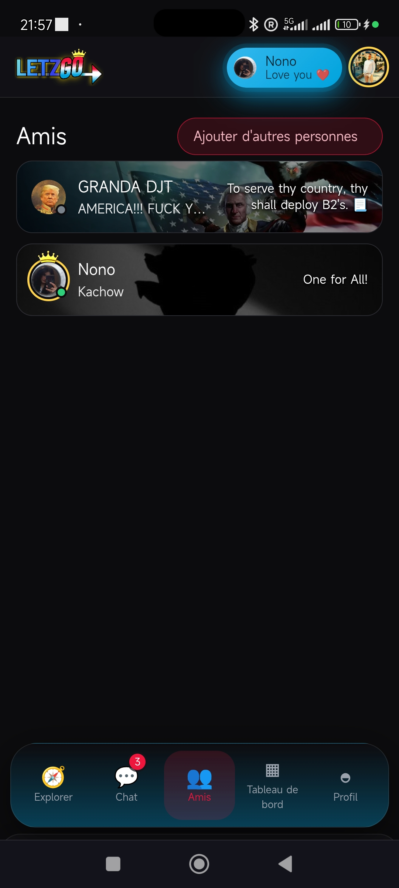

# LetzGo — Luxembourg Utility PWA

**Real-time hyper-local information for Luxembourg residents and cross-border commuters.**

[🌐 Open LetzGo](https://letz-go.vercel.app) <!-- replace with your actual URL -->

## What is LetzGo?

LetzGo is a fast, beautiful, and **offline-first Progressive Web App** that brings together everything you need for daily life in Luxembourg:

- **Live Parking** — Availability, history, photos and payment options
- **EV Charging** — Chargy network status, tariffs and live availability
- **Fuel Prices** — Real-time prices across stations
- **On-duty Pharmacies & Services**
- **Friends & Social** — Location sharing and in-app calls
- **Push Notifications** — Stay updated even when the app is closed

Built from the ground up as a true PWA — installable on iOS and Android with native-like experience (splash screens, shortcuts, offline support).

## Why LetzGo?

Luxembourg is small but mobility needs are high. LetzGo combines multiple scattered services into one clean, reliable tool that works even with poor connectivity.

## Features

- Fully offline-capable (Service Workers + cached data)
- Native app-like feel on mobile and desktop
- Fast loading and smooth Leaflet map experience
- Automated data updates via Python pipelines
- Privacy-focused & lightweight

## Tech Stack

- **Frontend**: Vanilla JavaScript, Leaflet, PWA (Manifest + Service Worker)
- **Data**: Python scrapers + GitHub Actions → static JSON
- **Hosting**: Vercel
- **Extras**: Push notifications, WebRTC, Stripe-ready

## Screenshots

<!-- Add 2-4 screenshots here -->

## Links

- **Live App**: [letzgo.lu](https://letzgo.lu)
- Founder: [Your Name](https://github.com/yourusername)

---

⭐ Star this repo if you're in Luxembourg or find it useful!

Built with ❤️ in Luxembourg.
